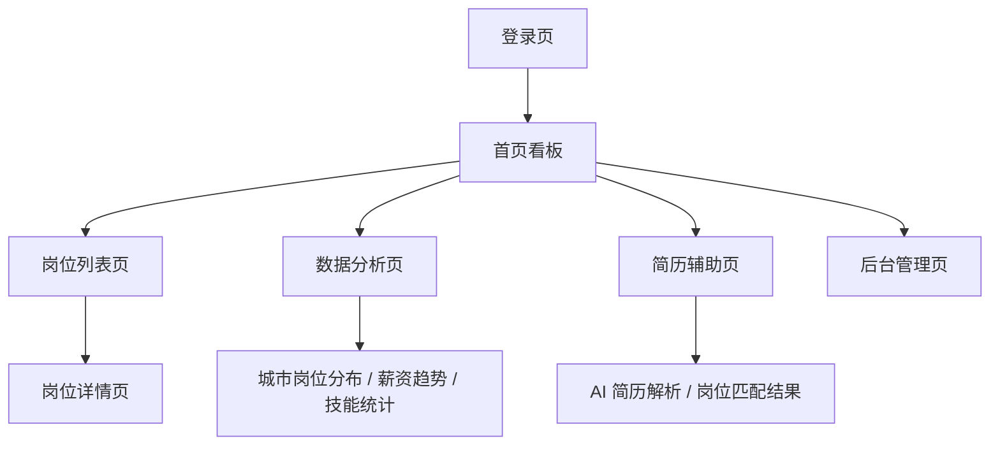

# 01 前端线框图与可操作原型说明

## 1. 当前原型完成情况

当前项目已经实现了一个可运行的低保真前端原型，启动后可通过浏览器访问：

```text
http://localhost:5173/
```

已具备的页面包括：

- 登录页
- 首页看板
- 岗位列表页
- 岗位详情页
- 数据分析页
- 简历辅助页
- 后台管理页

当前原型重点用于展示页面结构、功能边界和用户操作流程，尚未实现完整的真实业务数据联动。

## 2. 页面流程线框图



## 3. 登录页线框图

```text
+--------------------------------------------------+
|                就业分析平台                      |
|     当前为前端框架页，后续接入真实登录接口       |
|                                                  |
|  用户名  [____________________________]           |
|  密码    [____________________________]           |
|                                                  |
|              [ 进入系统 ]                        |
+--------------------------------------------------+
```

对应页面：

```text
frontend/src/views/LoginView.vue
```

## 4. 系统主布局线框图

```text
+--------------------+---------------------------------------------+
| 就业分析平台        | 当前页面标题                     登录入口   |
| Job Analytics       | 招聘数据分析与智能求职辅助平台             |
|--------------------+---------------------------------------------|
| 首页看板            |                                             |
| 岗位列表            |                                             |
| 数据分析            |              主内容区域                     |
| 简历辅助            |                                             |
| 后台管理            |                                             |
+--------------------+---------------------------------------------+
```

对应页面：

```text
frontend/src/layouts/MainLayout.vue
```

## 5. 首页看板线框图

```text
+----------------+----------------+----------------+----------------+
| 岗位总数        | 覆盖城市        | 热门技能        | 平均薪资        |
| 1,280          | 18             | Java           | 12.6K          |
+----------------+----------------+----------------+----------------+

+-------------------------------------------------------------------+
| 开发入口                                                          |
| [ 查看岗位 ]  [ 数据分析 ]  [ 简历辅助 ]                         |
+-------------------------------------------------------------------+
```

对应页面：

```text
frontend/src/views/DashboardView.vue
```

## 6. 岗位列表页线框图

```text
+-------------------------------------------------------------------+
| 岗位列表                                                          |
| 城市 [__________]  关键词 [__________]  [ 筛选 ]                  |
|-------------------------------------------------------------------|
| 岗位名称              公司          城市      薪资       操作     |
| Java 后端开发实习生   示例科技      上海      10K-15K    详情     |
| 前端开发实习生        数智未来      杭州      8K-12K     详情     |
| 数据分析助理          云启数据      深圳      9K-13K     详情     |
+-------------------------------------------------------------------+
```

对应页面：

```text
frontend/src/views/JobListView.vue
```

## 7. 岗位详情页线框图

```text
+-------------------------------------------------------------------+
| 岗位详情                                                          |
|-------------------------------------------------------------------|
| 岗位 ID       1                                                   |
| 岗位名称      Java 后端开发实习生                                  |
| 城市          上海                                                |
| 薪资          10K-15K                                             |
| 技能要求      Java、Spring Boot、MySQL                            |
| 学历要求      本科及以上                                           |
+-------------------------------------------------------------------+
```

对应页面：

```text
frontend/src/views/JobDetailView.vue
```

## 8. 数据分析页线框图

```text
+--------------------------------------+----------------------------+
| 城市岗位分布                          | 分析指标                   |
|                                      |----------------------------|
|         ECharts 柱状图区域            | 平均薪资：12.6K            |
|                                      | 岗位数量最高城市：上海      |
|                                      | 热门技能：Java             |
+--------------------------------------+----------------------------+
```

对应页面：

```text
frontend/src/views/AnalysisView.vue
```

## 9. 简历辅助页线框图

```text
+-------------------------------------------------------------------+
| 简历辅助                                                          |
|-------------------------------------------------------------------|
|                                                                   |
|              拖拽简历到此处，或点击选择文件                       |
|                                                                   |
|    当前为框架页，后续接入后端文件上传和 AI 解析                    |
+-------------------------------------------------------------------+
```

对应页面：

```text
frontend/src/views/ResumeView.vue
```

## 10. 后台管理页线框图

```text
+-------------------------------------------------------------------+
| 后台管理                                                          |
|-------------------------------------------------------------------|
| 模块              状态        负责人                              |
| 岗位数据管理      待开发      后端负责人                          |
| 用户管理          待开发      后端负责人                          |
| 数据清理          待开发      数据负责人                          |
+-------------------------------------------------------------------+
```

对应页面：

```text
frontend/src/views/AdminView.vue
```

## 11. 汇报回答口径

如果被问到“是否设计了线框图 / 可操作原型”，可以回答：

> 我们当前已经完成了可运行的低保真可操作原型，用户可以通过浏览器进入系统，并访问登录、首页看板、岗位列表、岗位详情、数据分析、简历辅助和后台管理等页面。线框图主要根据现有页面结构整理，后续可以在 Figma、ProcessOn 或 draw.io 中进一步绘制高保真原型。

