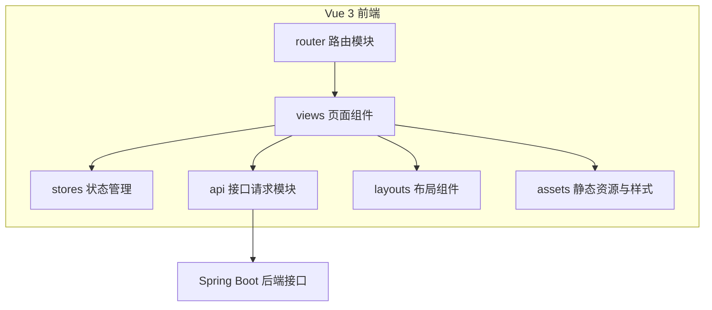
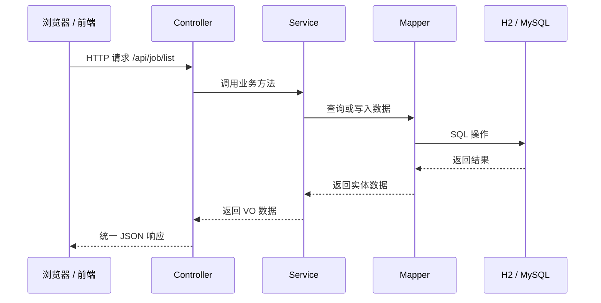

# 02 MVC 组件说明

## 1. 前端是否是传统 MVC

本项目前端采用 Vue 3 单页应用架构。严格来说，Vue 前端不是传统 MVC，而是更接近 **组件化 MVVM / 前端分层架构**。

在汇报时可以将前端结构类比为：

- Model：状态数据、接口数据、业务数据模型。
- View：页面组件和布局组件。
- Controller / ViewModel：路由控制、事件处理、接口调用和数据绑定逻辑。

## 2. 前端 MVC / MVVM 对应关系

| 角色 | 当前项目目录 / 文件 | 作用 |
| --- | --- | --- |
| Model | `frontend/src/stores` | 前端状态管理，例如用户信息、登录状态 |
| Model | `frontend/src/api` | 后端接口封装，例如岗位列表、数据分析接口 |
| View | `frontend/src/views` | 页面级视图，例如首页、岗位列表、数据分析页 |
| View | `frontend/src/layouts` | 系统整体布局，例如侧边栏、顶部栏、主内容区 |
| Controller / ViewModel | `frontend/src/router` | 页面路由、页面跳转、访问控制预留 |
| Controller / ViewModel | 各 `.vue` 文件中的 `script setup` | 页面事件处理、接口调用、数据绑定 |

## 3. 前端组件划分图



## 4. 当前前端页面组件

```text
frontend/src/views
├── LoginView.vue
├── DashboardView.vue
├── JobListView.vue
├── JobDetailView.vue
├── AnalysisView.vue
├── ResumeView.vue
└── AdminView.vue
```

## 5. 后端 MVC / 三层架构

后端采用 Spring Boot 三层架构，可以比较标准地对应 MVC / 分层架构：

| 层次 | 当前项目包 | 作用 |
| --- | --- | --- |
| Controller | `controller` | 接收前端 HTTP 请求，返回 RESTful JSON |
| Service | `service`、`service.impl` | 处理业务逻辑 |
| Mapper / DAO | `mapper` | 数据访问层，后续连接 MySQL |
| Model | `entity`、`dto`、`vo` | 实体对象、请求对象、响应对象 |
| Common | `common` | 统一返回结构 |
| Config | `config` | 跨域、MyBatis 等配置 |
| Exception | `exception` | 全局异常处理 |

## 6. 后端 MVC 流程图



## 7. 汇报回答口径

如果被问到“前端 MVC 组件是什么”，可以回答：

> 我们前端采用 Vue3 组件化架构，不是传统后端 MVC。对应关系上，Model 由 Pinia 状态管理和 API 请求模块承担，View 由 Vue 页面组件和布局组件承担，Controller / ViewModel 由 Vue Router、页面事件处理和接口调用逻辑承担。后端则采用 Spring Boot 三层架构，Controller 负责接口，Service 负责业务逻辑，Mapper 负责数据访问，Entity / DTO / VO 负责数据模型。

