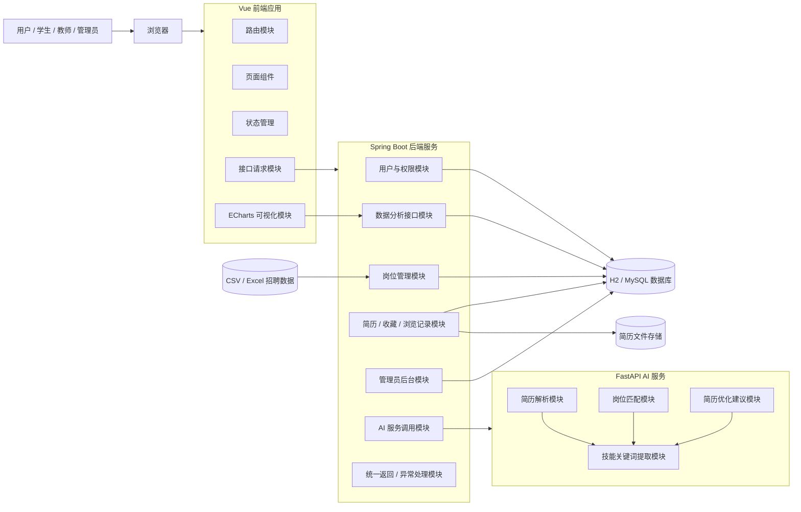

# 03 系统组件图

## 1. 系统核心组件

本项目采用前后端分离架构，并将 AI 能力拆分为独立服务。

系统核心组件包括：

- 用户浏览器
- Vue 前端应用
- Spring Boot 后端服务
- FastAPI AI 服务
- H2 / MySQL 数据库
- 简历文件存储
- 示例数据 / 数据导入模块

## 2. 系统组件图

## 3. 当前已实现的组件

| 组件 | 当前实现程度 |
| --- | --- |
| Vue 前端应用 | 已实现基础页面、路由、布局、图表和模拟数据 |
| Spring Boot 后端服务 | 已实现基础 Controller、Service、统一返回、模拟接口 |
| FastAPI AI 服务 | 已实现健康检查、简历解析、岗位匹配、简历建议模拟接口 |
| H2 数据库 | 已配置本地内存数据库，便于直接启动 |
| MySQL | 已预留驱动，后续需要接入真实数据库 |
| 文件存储 | 当前未实现真实上传，前端已有上传页面 UI |
| 数据导入 | 当前只有示例 CSV，后续需要实现导入接口 |

## 4. 汇报回答口径

如果被问到“项目组件图是怎样的”，可以回答：

> 我们的系统组件分为前端应用、后端业务服务、AI 服务和数据存储四部分。前端负责页面展示、路由跳转、状态管理和图表展示；后端负责用户、岗位、分析、简历、后台管理等业务接口；AI 服务负责简历解析、岗位匹配和优化建议；数据库负责保存用户、岗位、简历、收藏和浏览记录等数据。各组件之间通过 HTTP JSON 接口通信，模块边界清晰，便于团队分工开发。

