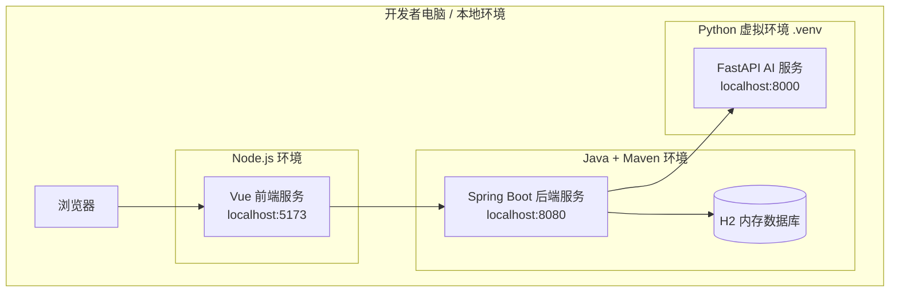
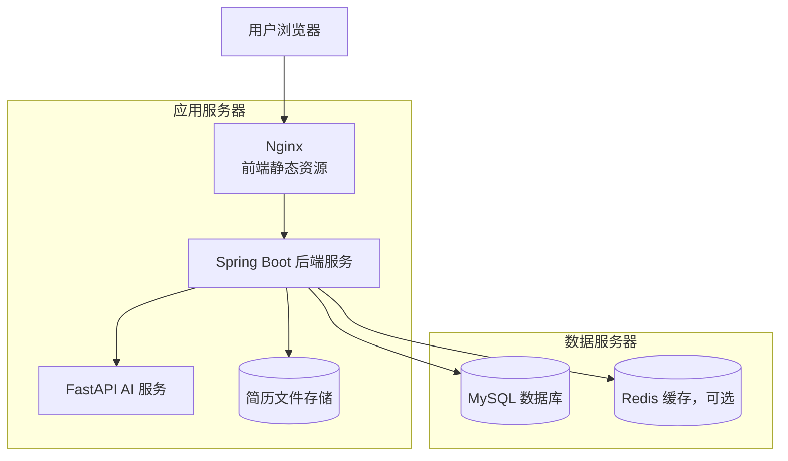

# 04 系统部署图

## 1. 当前本地开发部署

当前阶段项目部署在本地开发环境中，三端分别占用不同端口：

| 服务 | 技术 | 端口 | 地址 |
| --- | --- | --- | --- |
| 前端服务 | Vite + Vue 3 | 5173 | `http://localhost:5173/` |
| 后端服务 | Spring Boot | 8080 | `http://localhost:8080` |
| AI 服务 | FastAPI + Uvicorn | 8000 | `http://localhost:8000` |
| 数据库 | H2 内存数据库 | 后端内嵌 | `jdbc:h2:mem:job_platform` |

## 2. 本地开发部署图

## 3. 未来生产环境部署设想

后续如果部署到服务器，可以采用以下方案：

- Vue 前端打包为静态资源，部署到 Nginx。
- Spring Boot 后端部署为独立 Java 服务。
- FastAPI AI 服务部署为独立 Python 服务。
- MySQL 独立部署，用于业务数据持久化。
- Redis 可选，用于缓存热点统计和 AI 匹配结果。
- 简历文件可存储在服务器磁盘或对象存储中。

## 4. 生产环境部署图

## 5. 汇报回答口径

如果被问到“项目部署图是怎样的”，可以回答：

> 当前开发环境中，前端运行在本地 5173 端口，后端运行在 8080 端口，AI 服务运行在 8000 端口，后端默认使用 H2 内存数据库，因此不需要额外安装 MySQL 就能启动项目。未来正式部署时，前端可以由 Nginx 提供静态资源服务，Spring Boot 和 FastAPI 作为独立后端服务运行，数据持久化切换到 MySQL，Redis 作为可选缓存。

