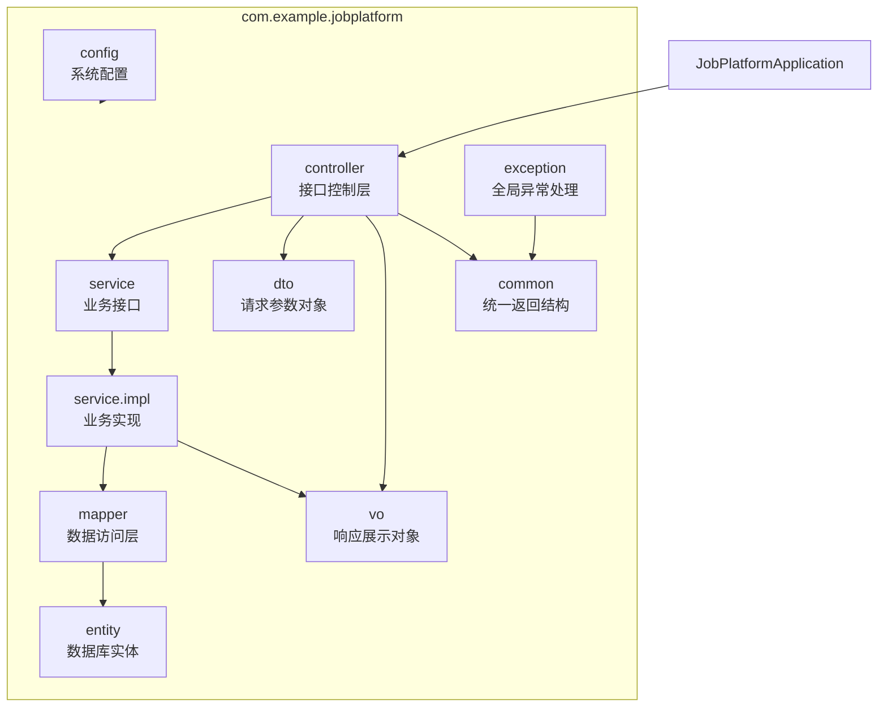
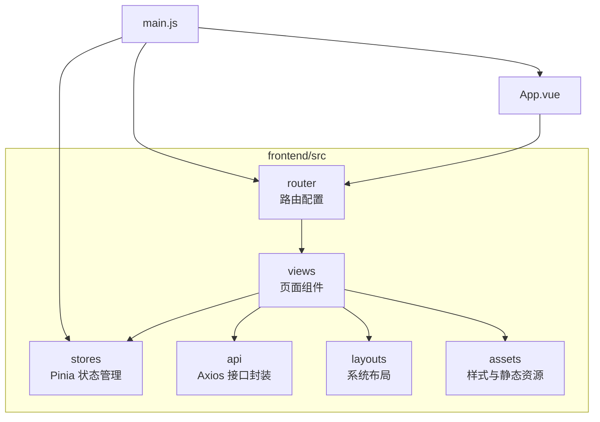
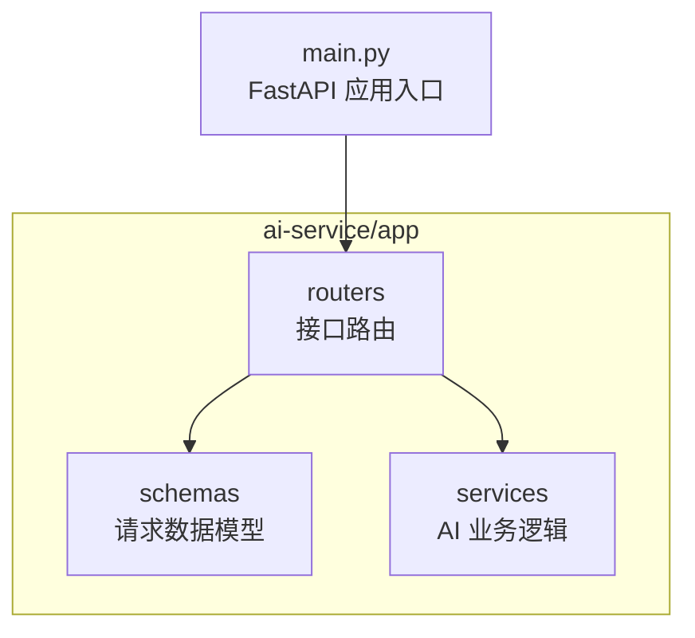

# 05 系统包图

## 1. 后端包结构

当前后端主要包结构如下：

```text
backend/src/main/java/com/example/jobplatform
├── common
├── config
├── controller
├── dto
├── entity
├── exception
├── mapper
├── service
├── service/impl
├── vo
└── JobPlatformApplication.java
```

## 2. 后端包图



## 3. 前端包结构

当前前端主要目录结构如下：

```text
frontend/src
├── api
├── assets
├── layouts
├── router
├── stores
├── views
├── App.vue
└── main.js
```

## 4. 前端包图



## 5. AI 服务包结构

当前 AI 服务主要目录结构如下：

```text
ai-service/app
├── routers
├── schemas
├── services
└── main.py
```

## 6. AI 服务包图



## 7. 汇报回答口径

如果被问到“项目包图是怎样的”，可以回答：

> 后端按照 Spring Boot 常见三层架构划分为 controller、service、service.impl、mapper、entity、dto、vo、common、config、exception 等包；前端按照 Vue 项目结构划分为 views、layouts、router、stores、api、assets；AI 服务按照 FastAPI 项目结构划分为 routers、schemas、services。这样的包划分能够清晰区分页面展示、接口请求、业务处理、数据访问和 AI 计算，方便团队成员并行开发。

